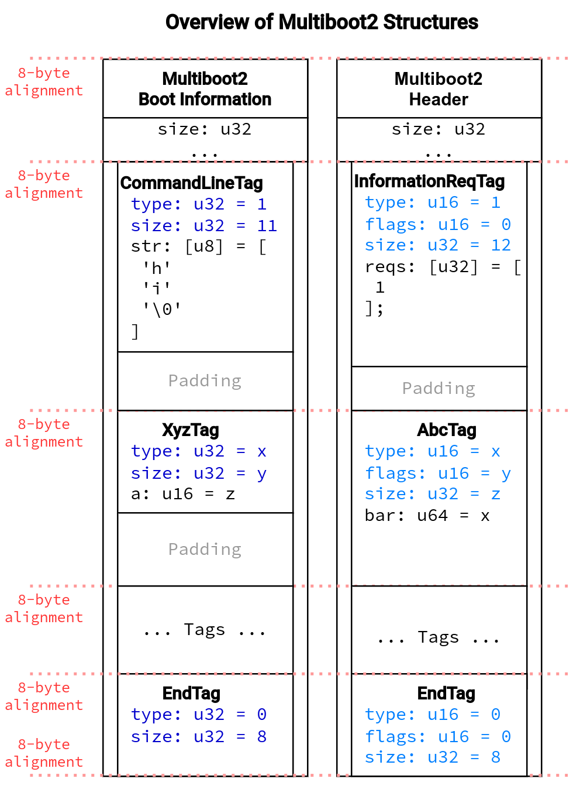
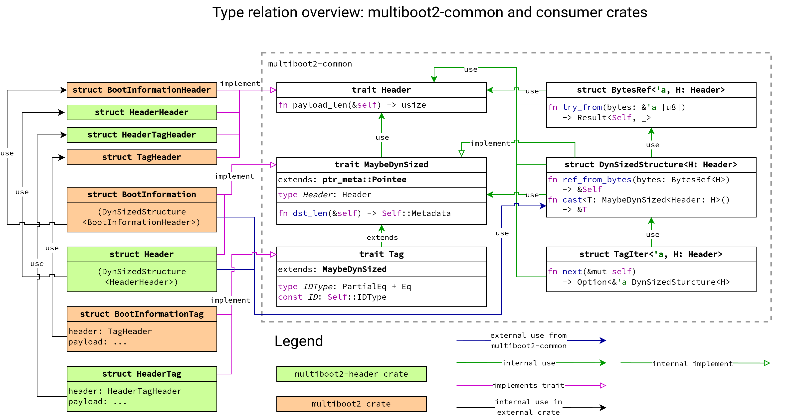

# multiboot2-common

Common helpers for the `multiboot2` and `multiboot2-header` crates.

## Architecture Diagrams

The following figures, not displayable in `lib.rs` / on `docs.rs` unfortunately,
outline the design of this crate. In the following figure, you can see the
four classes of Multiboot2 structures and their memory properties. The four
kinds of Multiboot2 structures are boot information, boot information
tags, header, and header tags. All share the same technical foundation: They
have a common header and a possible dynamic size, depending on the header.

In the next figure, you see how the types from `multiboot2-common` are used
to parse a raw byte slice as the corresponding Multiboot2 structure a safe
manner. The `BytesRef` wrapper ensures basic memory guarantees for the
underlying `&[u8]` slice, while `DynSizedStructure` can then be used to
safely cast to the target type.

The last complex figure shows all traits and structs from `multiboot2-common`,
their internal relation, and how consumers (`multiboot2` and
`multiboot2-header`) consume them. As this figure is quite complex, we recommend
to first study the inner box (`multiboot2-common`) and then study how types from
`multiboot2` (orange) and `multiboot2-header` (green) interface with
`multiboot2-common`.

## MSRV

The MSRV is 1.75.0 stable.

## License & Contribution

See main [README](https://github.com/rust-osdev/multiboot2/blob/main/README.md)
file.
